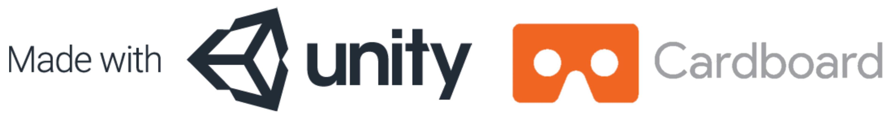

# The Island
The Island is a mobile VR game developed by [Qian Yu](https://www.linkedin.com/in/qian-yu-4aba7aa6/) and [Chi Zhang](https://www.linkedin.com/in/zhang-chi/) using [Unity](https://unity3d.com/) and [Google VR SDK](https://developers.google.com/vr/unity/). This game is also a course project for Virtual Reality[(EE267)](https://stanford.edu/class/ee267/) at Stanford University, Spring 2017.

## Description
The Island is an interactive, creative and entertaining first-person tower defense game, providing players with an highly immersive VR experience. In this game, players will protect an island with weapons from monster attackers. The various options of weapons on different locations offer players flexibility of their strategic plans. And players can fully enjoy the game with portable and affordable [Google Cardboard](https://vr.google.com/cardboard/) on mainstream mobile platform, such as iOS and Android.

## Game Settings and Rules
- **Attackers**
- **Waypoints**
- **Weapons**
- **Rounds**

## Features
- **Switch weapons via waypoints**
- **Autofire via colliders**
- **Enemy AI: navigation map**
- **Gunshot and explosion effect**
- **Airstrike and grenade attacks**
- **Terrain**
- **Audio**

## Software
- [Unity3D 5.6.0of3](https://unity3d.com/get-unity/download/archive?_ga=2.28944888.572166148.1496956683-820167089.1493087022) (Personal Edition)
- [Google VR SDK for Unity v1.50](https://developers.google.com/vr/unity/download) (May 2017)
- Scripts are written in [C#](https://docs.microsoft.com/en-us/dotnet/csharp/csharp) using [Unity API](https://docs.unity3d.com/ScriptReference/).

:warning: We initially used Unity3D 5.6.1 for development, however, it seemed it had compatibility issues with GVR SDK. To achieve the same functionality, we strongly suggest you use exactly the same versions of software.

## Used Assets
All of the assets used in the project were downloaded from [Unity Asset Store](https://www.assetstore.unity3d.com/en/#!/) and [DEVAsserts](http://devassets.com/) by [Brackeys](https://www.youtube.com/user/Brackeys). The copyrights are owned by corresponding developers.
#### Monster Models
- [Zombie](https://www.assetstore.unity3d.com/en/#!/content/30232)
- [Golem](https://www.assetstore.unity3d.com/en/#!/content/33260)
- [Monster 3](https://www.assetstore.unity3d.com/en/#!/content/48933)
#### Weaponry
- [Modern Guns](http://devassets.com/assets/modern-weapons/)
- [Grenade Pack](https://www.assetstore.unity3d.com/en/#!/content/83440)
#### Skybox
- [Classic Skybox](https://www.assetstore.unity3d.com/en/#!/content/24923)
#### Waypoints
- [Udaicty VR Waypoints]()
#### Environment
- [Desert Environment](http://devassets.com/assets/desert-environment/)

## Download

## Ackonwledgement

## License
Free for personal and educational use. For commercial purposes, please <a href='mailto:czhang94@stanford.edu,qiany@stanford.edu'>contact us</a>.

## Copyright Disclaimer :copyright:
The use of the copyrighted work involved in this project is for educational purposes, and should be considered fair use.
