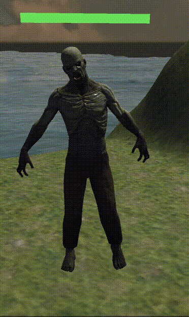
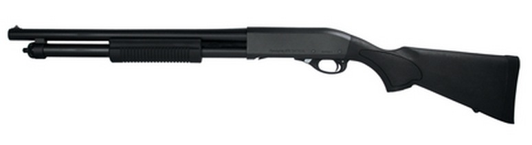
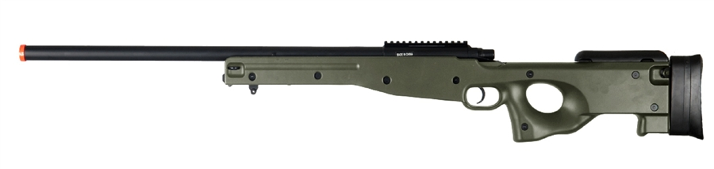
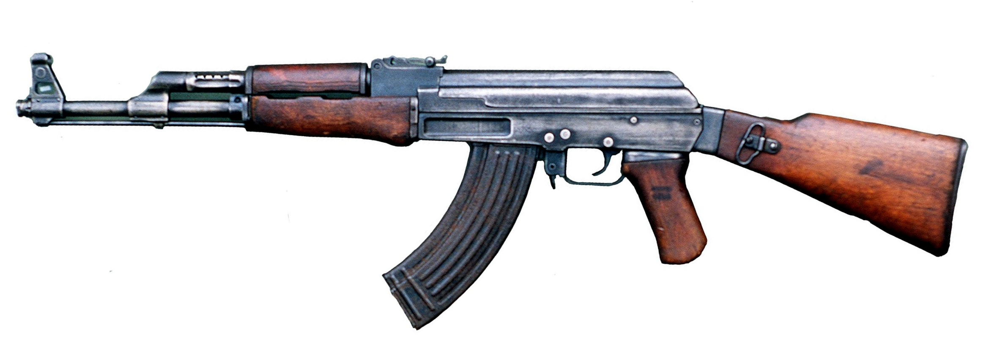
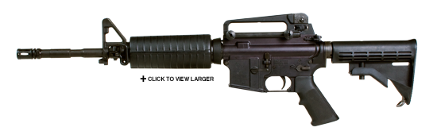
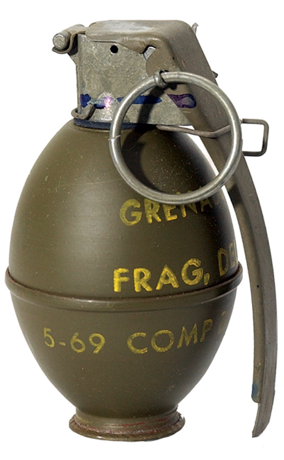

# The Island
The Island is a mobile VR game developed by [Qian Yu](https://www.linkedin.com/in/qian-yu-4aba7aa6/) and [Chi Zhang](https://www.linkedin.com/in/zhang-chi/) using [Unity](https://unity3d.com/) and [Google VR SDK](https://developers.google.com/vr/unity/). This game is also a course project for Virtual Reality[(EE267)](https://stanford.edu/class/ee267/) at Stanford University, Spring 2017.

## Description
The Island is an interactive, creative and entertaining first-person tower defense game, providing players with an highly immersive VR experience. In this game, players will protect an island with weapons from monster attackers. The various options of weapons on different locations offer players flexibility of their strategic plans. And players can fully enjoy the game with portable and affordable [Google Cardboard](https://vr.google.com/cardboard/) on mainstream mobile platform, such as [iOS](https://en.wikipedia.org/wiki/IOS) and [Android](https://en.wikipedia.org/wiki/Android_(operating_system)).

**Note:** we provied Xcode project for installing our game app on your iPhone in `Download`. [Check it out!](https://github.com/chizhang529/vr-the-island#download)

## Game Settings and Rules
- **Attackers**

  There exist three types of monster attackers in the game:
  
  |                          Model                             |     Name      |   HP  |   Initial Speed(m/s)  |  Probability | 
  |:---------------------------------------------------------: |:-------------:| :----:| :---------------:| :-----------:|
  |    |    Goliath    |   170 |       0.5        |      0.2     |
  |     |    Zombie     |   80  |       1.0        |      0.3     |
  |      |    Golem      |   60  |       2.0        |      0.5     |

- **Weapons**
  
  Refer to the table below for details of weapons:
  
  |                            Model                               |       Name       |   Ammo  |      Damage      |  Shot Interval(s) |   Cool Down(s)  |
  |:-------------------------------------------------------------: |:----------------:| :------:| :---------------:| :----------------:| :-------------: |
  |    |    870 Shotgun   |     20  |       30         |         1.0       |        10       |     
  |    | L96 Sniper Rifle |     10  |       50         |         1.0       |        10       |
  |   |      AK-47       |     60  |        5         |        0.05       |         5       |
  |     |    M4 Carbine    |     50  |       10         |        0.05       |         5       |
  | |      Pistol      |     30  |        5         |         0.3       |         3       |
  | |   M26 Grenade    |      5  |      100         |         2.0       |         5       |
  |  |    Airstrike     |      1  |      200         |         N/A       |        30       |
  
  Also, all barrels and pressure tanks in the game are shootable explosives with specifications:
  
  |      Name     | Radius(m) |   Damage  | 
  | :-----------: | :-------: | :-------: |
  |     Barrel    |     30    |     150   |
  | Pressure Tank |     50    |     300   |
  
- **Waypoints**

  8 waypoints are provided for players to navigate the map and switch weapons associated with waypoints
  
- **Rounds**

  **Protect your waypoints from monsters!**
  
  In each round, a new monster will be generated every *t* seconds (*t*: a random number between 1 and 2) and the monster type is determined by probability attribute of monster attackers. The target of monsters is the nearest existent waypoint and the waypoint will be destroyed once one monster arrives at its location. The player will be not able to use weapons associated with lost waypoints any more.
  
  > In the *nth* round: 
  > * amount of monsters = 2 x n
  > * monster speed = initial speed x n
  
  If the player eliminates all monsters, then a new round starts and all the weapons lost in the last round will resume with full ammunition. While there is no limit of rounds, players typically are not able to survive more than 10 rounds since there will be a huge number of monsters with really high speed. 

## Features
- **Switch weapons via waypoints**

- **Autofire via colliders**

- **Enemy AI: navigation map**

- **Gunshot and explosion effect**

- **Airstrike and grenade attacks**

- **Terrain**

- **Audio**

The background music is *Enemy of My Enemy is My friend* from [Call of Duty: Modern Warfare 2](https://en.wikipedia.org/wiki/Call_of_Duty:_Modern_Warfare_2). And all the other audio sources are collected from [Youtube](https://www.youtube.com/).

## Software
- [Unity3D 5.6.0of3](https://unity3d.com/get-unity/download/archive?_ga=2.28944888.572166148.1496956683-820167089.1493087022) (Personal Edition)
- [Google VR SDK for Unity v1.50](https://developers.google.com/vr/unity/download) (May 2017)
- Scripts are written in [C#](https://docs.microsoft.com/en-us/dotnet/csharp/csharp) using [Unity API](https://docs.unity3d.com/ScriptReference/).

:warning: We initially used Unity3D 5.6.1 for development, however, it seemed to have compatibility issues with GVR SDK. To achieve the same functionality, we strongly suggest you use exactly the same versions of software.

## Used Assets
All of the assets used in the project were downloaded from [Unity Asset Store](https://www.assetstore.unity3d.com/en/#!/) and [DEVAsserts](http://devassets.com/) by [Brackeys](https://www.youtube.com/user/Brackeys). The copyrights are owned by corresponding developers.
#### Monster Models
- [Zombie](https://www.assetstore.unity3d.com/en/#!/content/30232)
- [Golem](https://www.assetstore.unity3d.com/en/#!/content/33260)
- [Monster 3](https://www.assetstore.unity3d.com/en/#!/content/48933)
#### Weaponry
- [Modern Guns](http://devassets.com/assets/modern-weapons/)
- [Grenade Pack](https://www.assetstore.unity3d.com/en/#!/content/83440)
- [Free Laptop](https://www.assetstore.unity3d.com/en/#!/content/90315)
#### Skybox
- [Classic Skybox](https://www.assetstore.unity3d.com/en/#!/content/24923)
#### Waypoints
- [Udaicty VR Waypoints](https://www.udacity.com/course/vr-software-development--ud1014)
#### Environment
- [Desert Environment](http://devassets.com/assets/desert-environment/)

## Video Demo
The video demo(HD720p) is [here](https://youtu.be/RAfLkjD5wI8) on Youtube.

## Download
All C# scripts can be found in `Unity Scripts` folder and we also provide links to download our project:
- [Unity Project]()
- [Xcode Project]() for iOS

## Ackonwledgement
Thanks should go to [Brackeys](https://www.youtube.com/user/Brackeys), [Matthew Hallberg](https://www.youtube.com/channel/UClm2DY6pj3ygKoKhEVr7KFw) for their wonderful Unity tutorials on Youtube. Also, virtual reality courses on [Udacity](https://www.udacity.com/) provided us inspirations in building scenes and VR software development. 

## License
Free for personal and educational use. For commercial purposes, please <a href='mailto:czhang94@stanford.edu,qiany@stanford.edu'>contact us</a>.

## Copyright Disclaimer :copyright:
The use of the copyrighted work involved in this project is for educational purposes, and should be considered fair use.
